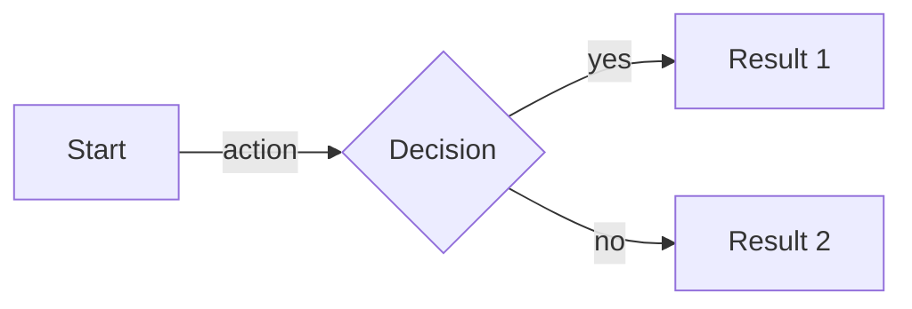
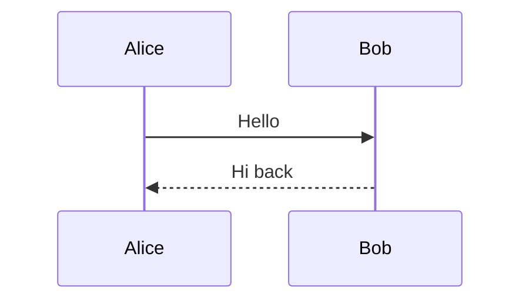
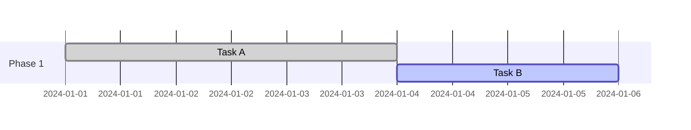

# Mermaid - Diagrams from Markdown-like Text

JavaScript-based diagramming tool that generates diagrams from text definitions.

**Links:** [GitHub](https://github.com/mermaid-js/mermaid) | [Live Editor](https://mermaid.live) | [Docs](https://mermaid.js.org)

## Supported Diagram Types

- **Flowchart** - Decision flows, process diagrams
- **Sequence diagram** - Interaction between systems/people
- **Gantt chart** - Project timelines, also hackable for bar charts
- **Class diagram** - OOP class relationships
- **State diagram** - State machines
- **Entity Relationship** - Database schemas
- **User Journey** - UX flows with satisfaction scores
- **Git graph** - Branch/merge visualization
- **Pie chart** - Simple proportions
- **C4 diagram** - Software architecture (context, container, component)

## Quick Syntax Examples

## Integrations

- **GitHub** - Native rendering in markdown files
- **Notion** - Via code blocks (limited)
- **VS Code** - Preview extensions available
- **Obsidian** - Native support
- **Documentation tools** - Most modern doc platforms support it

## When to Use

- Architecture documentation that needs to stay current with code
- Quick diagrams in PRs and issues
- Explaining flows to teammates without leaving the editor
- Version-controlled diagrams (text diffs instead of binary)

## Security Note

When rendering user-generated Mermaid content, use sandboxed iframe mode to prevent XSS. Report vulnerabilities to security@mermaid.live.
